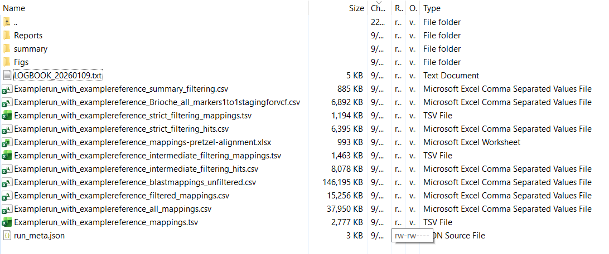
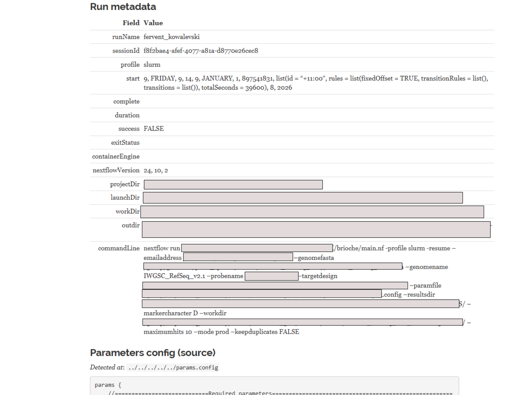
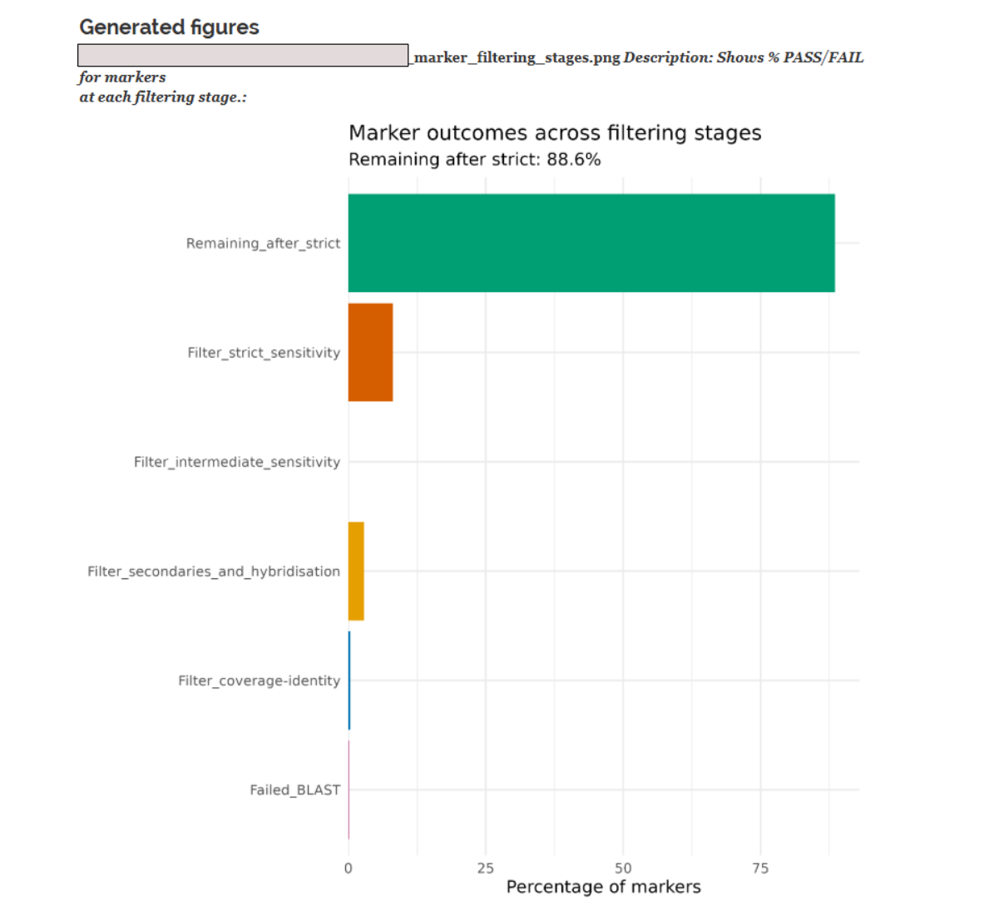
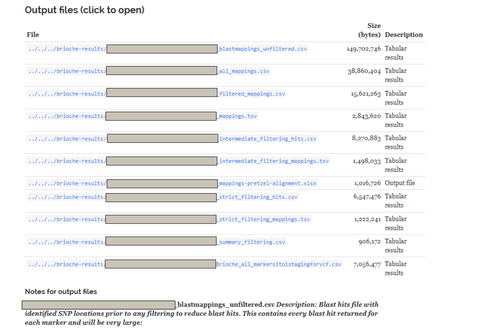
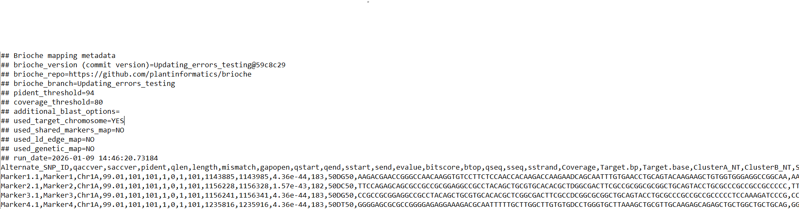
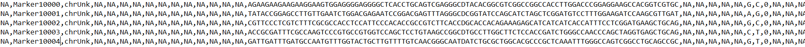

Results
=======

Results folder structure
------------------------

The Brioche results will be placed inside a folder labelled brioche-results in the pathway specified in the running nextflow script or the params.config file.

In this folder there is a combination of output files and folders. 

Summary report
--------------

The first results file to investigate is located in the summary/ folder and is called summary_core.html
This file can be opened up in any web browser as required. 

The summary report is broken up into four main sections

1. The summary of settings and parameters
~~~~~~~~~~~~~~~~~~~~~~~~~~~~~~~~~~~~~~~~~

At the top of the report is a list of all command line changes to nextflow and the complete output of the params.config file for reproducibility.

2. Summary results graphs
~~~~~~~~~~~~~~~~~~~~~~~~~

After all settings Brioche produces three separate figures. The first showing the % of markers culled at each filtering stage. The second showing the % of BLASTn hits culled at each stage.
The third showing the BLASTn count distributions of all markers after each filtering stage 

Below are examples of 1, and 3.

3. Table of results files
~~~~~~~~~~~~~~~~~~~~~~~~~

Below the figures there is a summary table of each results file describing its location and size followed by a notes section with a reminder of what each results file contains.

Results files
-------------

Brioche outputs several results files in the brioche-results directory which are useful for different reasons and usecases. These can be broadly split into two types of files, Intermediate results and final results

1. Intermediate results
~~~~~~~~~~~~~~~~~~~~~~~

In this category of results we have the markers and blast hits which represent all markers which passed each filtering step. 

e.g., 
'Examplerun_with_examplereference_blastmappings_unfiltered.csv' Represents the raw blast output of all markers before filtering steps are applied. This file contains the standard blast output columns plus additional columns tracking whether the SNP end is conserved (hybridisation), what the reference base of SNP is in positive strand, and any other mutations present in the marker and their positions

'Examplerun_with_examplereference_all_mappings.csv' Represents the first round of filtering, removing any hits which fail the %identity and %coverage thresholds set. This file is formatted like 'Examplerun_with_examplereference_blastmappings_unfiltered.csv'

'Examplerun_with_examplereference_filtered_mappings.csv' Represents the second round of filtering removing any hits/markers from 'Examplerun_with_examplereference_all_mappings.csv' which failed either the secondary hits filter, or the hybridisation filter
'Examplerun_with_examplereference_mappings.tsv' Represents a simpler version of 'Examplerun_with_examplereference_filtered_mappings.csv' with the majority of columns cut for ease of viewing.

'Examplerun_with_examplereference_intermediate_filtering_hits.csv' Represents the third round of filtering removing any hits/markers from 'Examplerun_with_examplereference_filtered_mappings.csv' which fail either through the priors files (e.g., linkage files) or through non identical local duplication (if local duplication is set), or through falling below a bitscore threshold calculated per chromosome per marker if no priors files are given.
'Examplerun_with_examplereference_intermediate_filtering_mappings.tsv' Represents a simpler version of 'Examplerun_with_examplereference_intermediate_filtering_hits.csv' with the majority of columns cut for ease of viewing.
'Examplerun_with_examplereference_mappings-pretzel-alignment.xlsx' Represents a results xlsx file of the results of intermediate filtering which is compatible for upload with the program pretzel for visual cross genome comparisons (see https://agg.plantinformatics.io/ )

2. Final results
~~~~~~~~~~~~~~~~

In this category of results we have run summary files and final marker results for 1:1 mappings. 

e.g., 

'Examplerun_with_examplereference_strict_filtering_hits.csv' Represents the final round of filtering with blast hits results from only the markers where a single hit and position can be determined.
'Examplerun_with_examplereference_strict_filtering_mappings.tsv' Represents a simpler version of 'Examplerun_with_examplereference_strict_filtering_hits.csv'

'Examplerun_with_examplereference_summary_filtering.csv' Is a csv file which contains a list of all markers, the hits per marker at each stage of filtering and whether they pass a filtering step' 
"""
Marker1,PASS,4,PASS,4,PASS,4,PASS,1,PASS,1
Marker2,PASS,3,PASS,3,PASS,3,PASS,1,PASS,1
"""

'Examplerun_with_examplereference_priors_informed_strictmapping.tsv' Is a tsv file containing additional information about whether priors files contributed to each individual marker being unique or not during the brioche analysis. Multiple priors can individually lead to the inclusion of a marker and so multiple 'True' results can return per marker
This file is used in downstream processes for anchoring and building VCFs (see the usecases section)
"""
qaccver	Trueunique	Chrommarkermap	proximatemarkermap	linkagemarkermap	geneticmapmarkermap	Duplicate_region
Marker1	NA	NA	TRUE	NA	NA	True
Marker2	True	NA	NA	NA	NA	NA
"""

'Examplerun_with_examplereference_marker_localdups_NULLS_counts.tsv' Is a tsv file which tracks the presence of local duplications of markers (inside the given bp region in the params.config file) as well as whether they all share the same base at the SNP site and lastly if the reference genome mapped against did not appear to have a real mapping for the marker (indicitive of a null allele in the reference genome) 
This file is used in downstream processes for insilico genotyping (see the usecases section)
"""
qaccver copy_number consensusbase keep nulcall
Marker1 2 true yes NA
Marker2 1 true yes NA
"""

'Examplerun_with_examplereference_Brioche_all_markers1to1stagingforvcf.csv' Is a csv file with required metadata of the run as well as an output file with one row per target marker input (targets file) in the pipeline where all unique markers are present and all markers failed to map uniquely are placed as chrUnk with NA for relevant fields
This file is the main file used to reanchor genotypes (see the usecases section)

 

Other results files
-------------------

In the brioche-results folder there are some additional files of note for run tracking/optimisation. 

In brioche-results/Reports you will find the '[date:time]_timeline.html' and '[date:time]_report.html' files. These contain a breakdown of the brioche run, resources used and time taken

Brioche usecases
----------------

Now that the basic results structure is understood, we can show how these results can be used to achieve any of the usescases described for brioche.

1. If you are interested in producing a VCF file of your results mapped to the new reference genome with reanchored genotype calls go to
:doc:`Usecase1: Remapping data across reference genomes <usecases/usecase1_remapping>`

2. If you are interested in extracting genotype calls from one or multiple reference genomes and adding them to your population genomics study go to 
:doc:`Usecase2: In silico genotyping of reference genomes <usecases/usecase2_insilico_genotyping>`

3. If you are interested in determining whether an existing marker dataset might be amplifying redundant regions under varied settings go to
:doc:`Usecase3: Testing redundancy/accuracy in marker datasets <usecases/usecase3_redundancy_accuracy>`

4. If you are interested in the creation of custom marker datasets from existing analyses and testing the likely redundancy of newly designed markers against a wide range of reference genomes for a target species (similar process as 3.) go to
:doc:`Usecase3: Testing redundancy/accuracy in marker datasets <usecases/usecase3_redundancy_accuracy>`

5. If you are interested in the mapping of multiple different datasets to a unified reference genome allowing for merging across shared loci and other downstream applications (e.g., imputations)
:doc:`Usecase4: Merge datasets <usecases/usecase4_merge_datasets>`

Alternatively, to return to how to set up a run: go to :doc:`Setting up a run <setting_up_a_run>`

