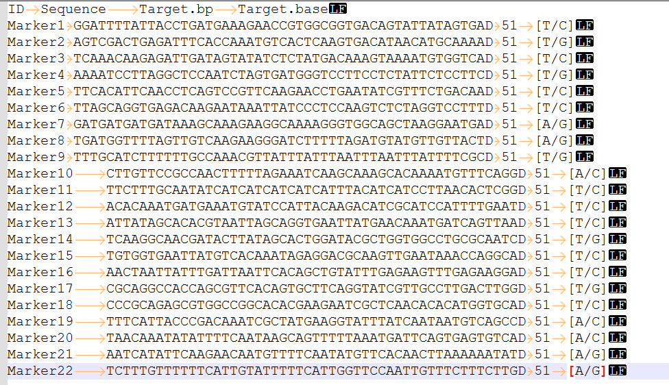
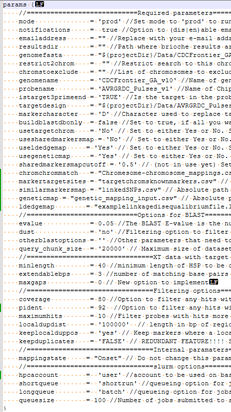

Setting up a run
================

Brioche inputs:
---------------

Brioche has one required input file (the brioche targets file) which is formatted as a TSV file with the following columns:

#. **ID** — the name of each marker
#. **Sequence** — the sequence to test for uniqueness and mapping in Brioche, with the target SNP position replaced with a non-ACGT character (e.g., ``D`` or ``X``)
#. **Target.bp** — the position of the SNP site of interest in the sequence provided
#. **Target.base** — a description of the REF/ALT of the expected SNP in the format ``[REF/ALT]`` for the marker

This file can be created manually by the user.

Alternatively some of the scripts in the Additional_funtions/ folder may assist 

e.g., If you have a VCF file and want to extract sequences from it to run Brioche you can run the file run_convert_vcf_to_brioche_input.sh

Options:

#. ``--vcfin`` — your VCF file
#. ``--refgenome`` — the reference genome to extract flanking sequence from
#. ``--left`` — size of the fragment to the left (upstream) of the SNP to return (e.g. 50 bp upstream of SNP). Value can be 0
#. ``--right`` — size of the fragment to the right (downstream) of the SNP to return (e.g. 50 bp downstream of SNP) Value can be 0
#. ``--chrommapping`` — pairwise chromosome-name mapping file (use if the VCF chrom names differ from the reference)

.. code-block:: console

   cd Additional_funtions/
   bash run_convert_vcf_to_brioche_input.sh \
   --vcfin file.vcf.gz \
   --refgenome genome1.fa \
   --left 50 \
   --right 2 \
   --chrommapping chrom_mapping.tsv \
   --outdir ./brioche_out

Or if you have a DArT report (1 row format). This requires R +v4.0.0 to either be installed as a module or for the user to install through conda. It also requires the installation of the R package "stringi" which occurs inside the script

Note: this will extract the AlleleSequence from the DArT report, the TrimmedSequence can be used instead if preferred by changing 2 lines in the script (Ln 93,101 See Usage documentation inside the script)

Options:

#. ``--dartfile`` — path to the 1-row format DArT report file
#. ``--targetmarker`` — letter to replace the SNP site with (e.g. ``D`` or ``X`` or ``N``)

.. code-block:: console

   cd Additional_funtions/
   module load R4.4.0
   Rscript DArT2Brioche_convert.R \
   --dartfile "dart_testing_build_briochefiles.csv" \
   --targetmarker "D"
  

Parameters file:
----------------

The parameters file for each run of brioche is found in the file params.config.

This file can be found in the brioche/ directory and has been populated with a number of default settings allowing for quick running of data. 

This file can be renamed so long as the variable --paramfile in the nextflow run (e.g., example_run_script_brioche.sh) is updated to the new name; otherwise the run will default to params.config.

There are 41 different parameter settings that can be changed in Brioche with a description of what each does and what each can be set to within the parameters file.

These parameters can broadly be categorised into 6 groups of variables with some of the main listed below.

1. Run execution settings
~~~~~~~~~~~~~~~~~~~~~~~~~

#. mode (whether to run as test or prod for real or test data)
#. notifications (whether to receive an email upon completion)
#. resultsdir (where to save results)

2. slurm settings
~~~~~~~~~~~~~~~~~

#. hpcaccount (the account name sbatch jobs should have to run)
#. shortqueue (the queue/partition for jobs which take <12 hours)
#. longqueue (the queue/partition for jobs which take >12 hours)
#. queuesize (the maximum number of slurmjobs to submit at any given time)

3. BLASTn settings
~~~~~~~~~~~~~~~~~~

#. evalue (minimum evalue to report BLASTn hits)
#. dust (whether to filter highly redundant sequences and not return any results e.g., long strings of CGCG or Ns)
#. otherblastoptions (any other BLASTn specific parameter to use e.g., --wordsize)
#. querychuncksize (Maximum number of markers parsed to BLASTn. If increased, memory requirements increase but can lead to small increases in speed)

4. Filtering options
~~~~~~~~~~~~~~~~~~~~

#. coverage (the minimum coverage required to pass the coverage filter)
#. pident (the minimum pairwise identity between the marker sequence and reference genome segment to pass the identity filter)
#. maximumhits (the maximum number of BLASTn hits a marker can have before the marker is filtered out)
#. istarget3primeend (whether to filter sequences which have mutations at the 3' end of the sequence, relevant for probe and SNP chip design data)
#. extendablebps (the number of bases required to be identical from 3' if istarget3primend is set to TRUE)
#. keeplocalduppos (whether to treat local duplications within a small range of the genome as unique and map to the first copy or redundant and filter [will filter if the SNP site differs regardless of what this is set to])
#. localdupdist (the distance upstream and downstream in base pairs to search for local duplications if keeplocalduppos is set to 'yes')

5. Anaylsis scope restricting settings
~~~~~~~~~~~~~~~~~~~~~~~~~~~~~~~~~~~~~~

#. restrict2chrom (only analyse hits against this chromosome of the reference genome)
#. chromstoexclude (a list of chromosomes to exclude from the reference genome)

6. Providing supplemental biological information to assist with determining optimal marker positions
~~~~~~~~~~~~~~~~~~~~~~~~~~~~~~~~~~~~~~~~~~~~~~~~~~~~~~~~~~~~~~~~~~~~~~~~~~~~~~~~~~~~~~~~~~~~~~~~~~~~

#. usetargetchrom (whether to use a pairwise list of preference chromosomes to match each marker to. Will result in equal quality hits across multiple chromosomes being preferenced to target chromosome and uniquely positioned)
#. markertargetsites (two column csv which lists each marker and the chromosome to map to [chromosomes can be in the old reference genome chromosome name], see example_files/targetchromsknownmarkers.csv)
#. chromchrommatch (a two column csv listing the names of the original reference genome chromosomes and the equivalent chromosome name for the new genome, see example_files/Chromesome-chromosome_mappings.csv)

#. usesharedmarkersmap (whether to use a csv list of closely linked marker names to inform the relative position of each marker. Will result in equal quality hits across multiple chromosomes/within a chromosome being preferenced to target a position closest in bp on the reference genome to the given linked markers and causing this marker to report as uniquely positioned)
#. similarmarkersmap (a multicolumn csv file which lists the target marker in the leftmost column and closely linked markers in the following columns, see example_files/linkedSNPs.csv)

#. useldedgemap (whether to use a raw linkage disequilibrium table between markers to match the optimal marker position on the genome. Will result in equal quality hits across/within chromosomes being preferenced to target the position which has the lowest bp distance from the most closely linked markers and cause this marker to report as uniquely positioned)
#. ldedgemap (the path to a pairwise linkage disequilibrium output table [format PLINK, TASSEL, HAPLOVIEW long tables] for linkage disequilibrium scores, see example_files/examplelinkagedisequalibriumfile.ld )

#. usegeneticmap (whether to use a genetic mapping file to infirm on the relative position of each marker. Will result in equal quality hits across multiple chromosomes being preferenced to target the identified chromosome by genetic mapping. Will also result in markers which map across multiple chromosomes in genetic mapping to be marked as not unique if any hits to those secondary chromosomes and which passed identity/coverage filtering  were found from BLASTn)
#. geneticmap (the path to a multicolumn csv with the first column being the marker name, the second the number of chromosomes this marker mapped to, the next 5 being the chromosome names it mapped to, and the next 5 columns being the counts which each chromosome was mapped to for the marker, see example_files/genetic_mapping_input.csv. Note, also requires chromchrommatch to be present to convert chrom names between old and new references)

Run parameters and goals
------------------------

The run configuration you choose depends on your workflow goal. We provide a more detailed breakdown of how some settings can be changed to best run for different usecases below but in general the settings desired should reflect

1. The nature of your data and the reference
~~~~~~~~~~~~~~~~~~~~~~~~~~~~~~~~~~~~~~~~~~~~

e.g., If your data is a probe design that is highly specific then a high coverage and identity is best to reflect the high specificty expected in your data.

e.g., If you know that the reference sequence you are mapping to is fairly diverged coverage and identity should be slightly lower to reflect the expected divergence outside of the SNP site. 

e.g., If your data is generated from more redundancy based methods e.g., reduced represenation sequencing there will likely be a very large number of markers that are not fully unique and so settings should reflect this fact

2. The purpose of the newly anchored data
~~~~~~~~~~~~~~~~~~~~~~~~~~~~~~~~~~~~~~~~~

e.g., If the intention is to identify strictly mapping data for position sensitive analyses (e.g., imputation) then settings should be conservative as it is more important to remove any potentially non uniquely mapped markers

3. Settings are not linear conservative/liberal
~~~~~~~~~~~~~~~~~~~~~~~~~~~~~~~~~~~~~~~~~~~~~~~

Lastly, consider that certain settings may result in more/fewer markers being mapped uniquely but this relationship is not necessarily linear. e

e.g., while increasing the pident and coverage thresholds increases the number of markers which failed at this early filtering step, it might also remove poorly mapping hits for markers resulting in only unique hits remaining and increasing the final 
number of uniquely mapping markers. 

This is why either setting setting to reflect the nature of the data (point 1) or exploring the results of multiple runs is recommended (see Additional_functions/Run_brioche_optimise.sh)

Other specific goals and scenarios can be seen in the example of different usecases.

- :doc:`Usecase1: Remapping data across reference genomes <usecases/usecase1_remapping>`
- :doc:`Usecase2: In silico genotyping of reference genomes <usecases/usecase2_insilico_genotyping>`
- :doc:`Usecase3: Testing redundancy/accuracy in marker datasets <usecases/usecase3_redundancy_accuracy>`
- :doc:`Usecase5: Merge datasets <usecases/usecase4_merge_datasets>`

Simple runs 
-----------

Once parameters are set and the targets file (Brioche input file) is created running Brioche is very straight forward. 

In the brioche landing directory there is an example .sh file for running Brioche, example_run_script_brioche.sh

In this file you will need to:

#. Update the Slurm ``sbatch`` commands:

   .. code-block:: bash

      # Multithreaded (SMP) job: must run on one node
      #SBATCH --nodes=1

      # The name of the job:
      #SBATCH --job-name="example_slurmjob"

      # The project ID which this job should run under:
      #SBATCH --account="default"

      # The partition in which to submit the job:
      #SBATCH --partition="batch"

      # Maximum number of tasks/CPU cores used by the job:
      #SBATCH --ntasks=1
      #SBATCH --cpus-per-task=8

      # The total amount of memory in the job:
      #SBATCH --mem=40GB

      # Send yourself an email when the job fails:
      #SBATCH --mail-type=FAIL
      #SBATCH --mail-user=user123@mail.mail

      # The maximum running time:
      #SBATCH --time=24:0:00

#. Update the run settings (paths, targets file, and required modules).

   Paying special attention to the targets file and making sure Nextflow, conda, and git are available (via ``module load`` or your own installation):

   .. code-block:: bash

      # Build target table for the new brioche format
      target=/filepath/briochetargetdesign.tsv

      # Used in naming of results files
      chipname="probename"

      # Directory of reference genome
      genomedir=/filepathgenome/

      # Genome name without extension
      genome="genomename"

      # Genome name with extension
      fasta="genomename.fa"

      # Param file can be set as anything, but if not set in the Nextflow command below,
      # it will default to the params.config in the same directory as main.nf
      params="/filepath/brioche/params.config"
      briochemain="/filepath/brioche/main.nf"

      # Required modules
      module load Nextflow
      module load Miniconda3
      module load git

      workdir="/filepath/brioche/results/${genome}_${chipname}/"
      resultsdir="/filepath/brioche/results/${genome}_${chipname}/"
      mkdir -p "${resultsdir}"
      mkdir -p "${workdir}"
      cd "${workdir}"

After updating the script can be run from a terminal with 

.. code-block:: console
   
   sbatch example_run_script_brioche.sh

Introduction:
~~~~~~~~~~~~~

To return to the Installation page go to :doc:`Installation <installation>`

Results:
~~~~~~~~

For investigating the results of a run go to :doc:`Results <results>`

