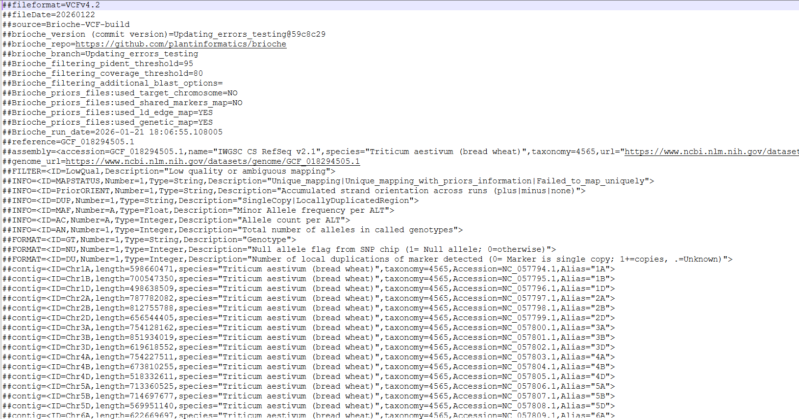
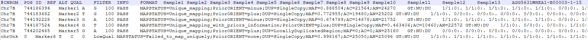

Usecase1: Remapping data across reference genomes
=================================================

This usecase describes how to use Brioche to remap any population dataset against a new reference genome

The usecase assumes that a Brioche run has been completed. For more information about creating a Brioche run and results see

Setting up a run :doc:`Setting up a run <../setting_up_a_run>`

Results of a run :doc:`Results folder structure <../results>`

Requirements 
~~~~~~~~~~~~

1. Brioche to have been run and the files below are present
'\*_Brioche_all_markers1to1stagingforvcf.csv'
'\*_marker_localdups_NULLS_counts.tsv'
'\*_priors_informed_strictmapping.tsv'

2. The genotype data file you have is in one of the following three forms 
	a) Raw genotypes with the below format type (tsv separated). REF/ALT defined as ACGT ACGT, samples as columns, markers as rows genotype coded as 0,1,2, NC as missing data and N as Null alleles
	"""
	Name	REF	ALT	Sample1	Sample2	etc
	Marker1	T	C	2	1
	Marker2	T	G	0	N
	Marker3	A	C	NC	1
	"""
	b) A VCF file (any vcf compatible format)
	c) DArTseq Report 1 row format. 

Runfile
~~~~~~~

To reanchor genotype data onto the new reference, a .sh script has been provided in the Additional_functions/ folder
Additional instructions are provided in the file but the main components to change are 

1) The Slurm sbatch header commands e.g., #SBATCH --job-name="example_anchoring"

2) the values of variable set in the section Variables to set in the script. There are 13 variables to set but most are changing the file paths and names of input/output files to the names generated in the specific brioche run

.. image:: ../Images/Variables_anchoring_script.png
   :alt: Parameters file
   :width: 300px
   :align: center

One variable the user can set which will change the result output files is the variable 

.. code-block:: console

   donextstages="yes"

When set to "yes", this will take the anchored VCF output file and 
1. Create an additional VCF which has all markers which failed to map removed
2. Convert the chromosome names to numeric 1-n values and sort the new file 

This new file is ready for analysis in software sensitive to VCF settings and unmapped markers e.g., imputation

Outputs
~~~~~~~

The VCF file produced contains metadata from the brioche run as well as multiple specifics to Brioche outputs to assist with results interpretation
At the top of the VCF file we can see Brioche metadata included as well as some NCBI derived data for the reference genome. This reference data is queried from NCBI so requires the user to provide the Accession or genome name in the input variables when they run the script.

In the body of the VCF file we can see a few of the additional values Brioche places into the VCF to assist with more informative downstream analysis

1) Brioche outputs two additional variables with each genotype 
Instead of a standard 1/1 0/0 etc, Brioche adds two additional fields NU and DU.
NU tracks the presence or absence of NULL allele states allowing for differentiation between missing data and true NULLs if the data type allows e.g., probe capture design
DU tracks the number of local duplications a marker hits to. For standard input genotype data this will always be . for unknown but when running insilico genotyping, added reference genomes will have counts for how many local duplications are detected.
This allows for a greater understanding of why certain markers may have higher heterozygosity for example, with reference genomes having 2 or 3 copies of a region markers genotyping this region might be picking up multiple different mutations in your samples sequenced

Brioche VCF outputs as a result take the format 1/1:0:. or 0/0:0:. or ./.:1:. as just some examples.

2) Several additional format flags are given 
e.g., MAPSTATUS=;PriorORIENT=;DUP=SingleCopy
This allows the user to easily see if the Mapping was unique through provided priors or not, whether the marker mapped positively or negatively to the reference genome, and whether there were local duplicates in the reference genome

Other usecases
--------------

If you are interested in other usecases see.

2. If you are interested in extracting genotype calls from one or multiple reference genomes and adding them to your population genomics study go to 
:doc:`Usecase2: In silico genotyping of reference genomes <usecase2_insilico_genotyping>`

3. If you are interested in determining whether an existing marker dataset might be amplifying redundant regions under varied settings go to
:doc:`Usecase3: Testing redundancy/accuracy in marker datasets <usecase3_redundancy_accuracy>`

4. If you are interested in the creation of custom marker datasets from existing analyses and testing the likely redundancy of newly designed markers against a wide range of reference genomes for a target species (similar process as 3.) go to
:doc:`Usecase3: Testing redundancy/accuracy in marker datasets <usecase3_redundancy_accuracy>`

5. If you are interested in the mapping of multiple different datasets to a unified reference genome allowing for merging across shared loci and other downstream applications (e.g., imputations)
:doc:`Usecase4: Merge datasets <usecase4_merge_datasets>`

otherwise, to return to the Introduction page go to :doc:`Introduction <../introduction>`