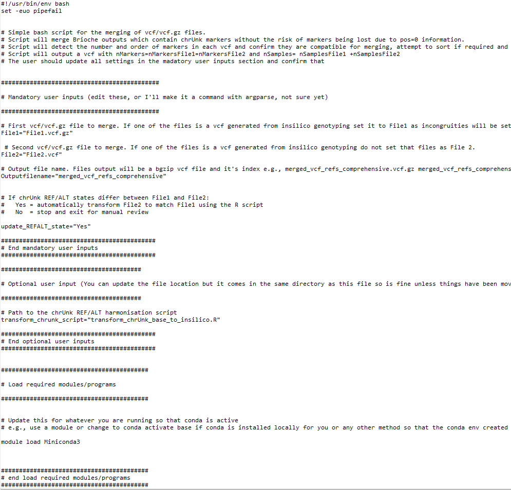

Usecase5: Combining VCF files of different samples anchored against the same reference
======================================================================================

This usecase describes how to use Brioche to merge two different VCF files together which were built by Brioche

The usecase assumes that you have two VCF files of the same markers anchored against the same reference genome

Brioche VCFs track markers which don't map to a specific reference so that genotype data is not lost when comparing between dozens of diverse reference genomes. This is both very useful for preserving data and is necessary for effective insilico genotyping. Unfortunately, this means that the VCFs produced by Brioche may not be directly compatible for merging with tools like bcftools. In Brioche we provide a specific script to assist with the merging of Brioche anchored VCFs.

This script is important in a number of specific situations. e.g., 

1. Brioche was used to anchor a large dataset of X thousand + samples producing an output VCF but a small amount of additional sequencing is undertaken and now the user wants to run Brioche anchoring on just the smaller dataset without reanchoring everything. Usecase1 can be used to anchor the new data only and the merge VCF scripts can merge the old and new dataset together in less time

2. Brioche was used to insilico genotype a large number of reference genomes as a vcf file. The user now has sequence data which wasn't available before and does not want to repeat the large insilico genotyping process so they can merge the insilico genotypes directly with the anchored genotypes of the sequence data.

Requirements 
~~~~~~~~~~~~

1. Two brioche generated anchored VCF/VCF.gz files are present

2. Both VCF/VCF.gz files are anchored for the same markers (same brioche mappings files used) and are anchored against the same reference genome

Runfile
~~~~~~~

To merge two VCFs together while preserving chrUnk mapping markers, a .sh bash script has been provided in the Additional_functions/ folder: Merge_comprehensive_vcfs.sh
Additional instructions are provided in the file but the main components to change are 

1) The mandatory user inputs section of the script. There are 4 Variables to set. File1 VCF, File2 VCF, the desired Output file name, and the variable update_REFALT_state

2) Make sure conda is loadable in the script e.g., update the module load Miniconda3 with your specific module or if conda is installed locally, conda activate base 

One variable the user can set which will change the result output file is the variable 

.. code-block:: console

   update_REFALT_state="Yes"

When set to "Yes", this will expand the script functionality to assist with merging VCFs with different REF/ALT states. 
When anchored to the same reference genome, all mapped markers will have the same REF ALT and be directly mergeable but this may not be the case for markers
which failed to map to the reference genome. This can affect the results in one of two ways.

1. If both VCF files have only been anchored once the REF/ALT of the unmapped markers will be the same as the REF/ALT input of the raw genotype data. This means there will be no difference between the two files and merging can proceed without other actions

2. If one VCF has been anchored to multiple reference genomes iteratively (e.g., insilico genotyping) a marker may have been anchored in a previous reference genome and the REF/ALT state changed. In this case the genotypes for these markers in one of the files need to be reanchored to keep the REF/ALT consistent

If this setting is set to "Yes" and these REF/ALT differences are detected, the REF/ALT state of File1 will be used to anchor File2 allowing for merging. If this setting is set to "No" and these REF/ALT differences are detected, the script will exit without merging

Outputs
~~~~~~~

The VCF file produced will contain all samples from both VCF files with all markers (including chrUnk). All Brioche header information is retained.

Other usecases
--------------

If you are interested in other usecases see.

1. If you are interested in easy remapping of markers across any distinct reference genome and the reanchoring of genotypes to the new reference genome 
:doc:`Usecase1: Remapping data across reference genomes <usecase1_remapping>`

2. If you are interested in extracting genotype calls from one or multiple reference genomes and adding them to your population genomics study go to 
:doc:`Usecase2: In silico genotyping of reference genomes <usecase2_insilico_genotyping>`

3. If you are interested in determining whether an existing marker dataset might be amplifying redundant regions under varied settings go to
:doc:`Usecase3: Testing redundancy/accuracy in marker datasets <usecase3_redundancy_accuracy>`

4. If you are interested in the creation of custom marker datasets from existing analyses and testing the likely redundancy of newly designed markers against a wide range of reference genomes for a target species (similar process as 3.) go to
:doc:`Usecase3: Testing redundancy/accuracy in marker datasets <usecase3_redundancy_accuracy>`

5. If you are interested in the mapping of multiple different datasets to a unified reference genome allowing for merging across shared loci and other downstream applications (e.g., imputations)
:doc:`Usecase4: Merge datasets <usecase4_merge_datasets>`

otherwise, to return to the Introduction page go to :doc:`Introduction <../introduction>`